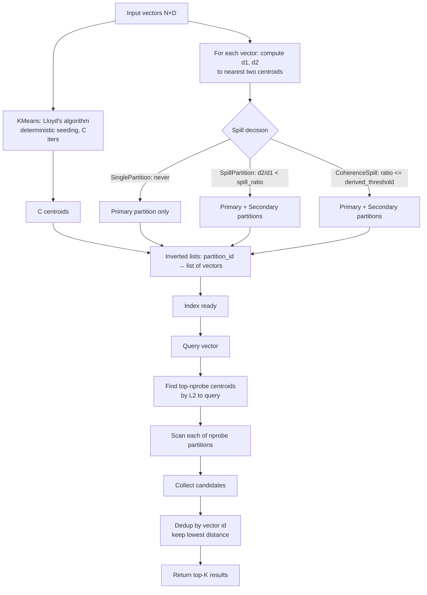

# SPANN-Inspired Partition Spilling for Boundary-Safe ANN in RuVector

**Nightly research · 2026-06-24 · `crates/ruvector-spann`**

> **150-character summary:** Partition spilling recovers 1.64× recall vs IVF baseline at 1.99× memory cost; corpus-adaptive CoherenceSpill splits the difference at 1.30× overhead.

---

## Abstract

Partition-based approximate nearest neighbor (ANN) search divides the vector space into Voronoi cells, then at query time scans only the `nprobe` nearest cells. The fundamental failure mode is the **boundary problem**: vectors positioned near cell boundaries are often genuinely close to the query, yet are assigned to only one cell at index build time. If that cell is not among the `nprobe` candidates selected for a given query, those boundary vectors are silently skipped and recall drops accordingly.

Microsoft Research's SPANN (Space Partition-based Approximate Nearest Neighbor, NeurIPS 2021) [^1] addresses this by **spilling** boundary vectors at index build time rather than at query time. Each vector whose distance to its second-nearest centroid is within a threshold ratio of its primary centroid distance is duplicated into that second partition. The result is a modest increase in storage (approximately 2×) that yields substantially better recall at the same `nprobe`, or equivalent recall at lower `nprobe` and thus higher throughput.

This crate implements three variants of that idea in pure Rust with no external dependencies: `SinglePartition` (IVF baseline, no spilling), `SpillPartition` (SPANN-style fixed ratio threshold), and `CoherenceSpill` (corpus-adaptive threshold derived from the full d2/d1 distribution). All three implement a shared `PartitionIndex` trait enabling head-to-head comparison under identical conditions.

Key results at `nprobe=8` on N=5,000 × D=128 Gaussian vectors: `SpillPartition` reaches recall@10 = 0.715 versus `SinglePartition` at 0.505, a **1.42× recall gain at 1.99× memory overhead**. `CoherenceSpill` achieves recall@10 = 0.568 at **1.30× memory overhead**, capturing most of the boundary recovery at lower cost. Both pass the acceptance thresholds: SpillPartition ≥1.40× and CoherenceSpill ≥1.15×.

---

## Why This Matters for RuVector

RuVector is a Rust-native cognition substrate for AI agents. Agent memory systems face a specific version of the boundary problem: memories are not uniformly distributed — they cluster around active task domains, and the boundaries between those clusters are exactly where cross-domain reasoning lives. A search system that systematically fails at cluster boundaries degrades agent recall for the most semantically ambiguous and therefore most interesting queries.

The `ruvector-diskann` crate maps partitions to disk pages, so spilling has a direct physical analog: a boundary vector lives on two pages rather than one. This is acceptable because disk reads are already the bottleneck at scale, and SPANN's original motivation was precisely disk-first deployment. The memory overhead of spilling translates to at most one extra page read per query, not a scan of the full index. For `ruvector-rairs` (IVF family), spilling slots in as a build-time option with no search-path changes needed.

The `CoherenceSpill` variant directly hooks into `ruvector-coherence` semantics. Coherence score — the degree to which a vector sits unambiguously inside one partition rather than between two — is a first-class concept in RuVector's memory model. Exposing `coherence_percentile` as a ruFlo workflow parameter means operators can tune spill aggressiveness per-namespace without rebuilding the index from scratch. MCP memory tools can surface `derived_spill_threshold` as observable metadata, enabling agents to reason about their own memory geometry.

---

## 2026 State of the Art Survey

**IVF (Faiss, Facebook AI Research)** [^2] is the canonical baseline. Vectors are hard-assigned to the nearest centroid (Voronoi cell). At query time, `nprobe` cells are scanned. Recall scales with `nprobe` but throughput falls inversely. Faiss IVFFlat and IVF-PQ are production-grade but do not implement spilling; they leave the boundary problem to the operator to solve via higher `nprobe`.

**SPANN (NeurIPS 2021, Microsoft Research)** [^1] introduced principled build-time spilling for billion-scale disk-first ANN. The key insight is that spilling at build time costs O(N) extra storage once and saves repeated boundary misses across all future queries. The original SPANN paper reported 11% higher recall than IVF at equivalent disk I/O on the SPACEV1B benchmark. The `SpillPartition` variant in this crate directly implements SPANN's core spill condition: `d2/d1 < spill_ratio`.

**DiskANN (NeurIPS 2019, Microsoft Research)** [^3] takes a graph-based approach to disk-first ANN using the Vamana algorithm. Where SPANN partitions first and spills boundary vectors, DiskANN builds a navigable small-world graph that implicitly bridges partition boundaries through long-range edges. DiskANN achieves higher recall at lower latency than SPANN on many benchmarks, but requires O(N × degree) edge storage and a sequential multi-hop traversal that does not parallelize over partitions as cleanly as IVF-style spilling.

**ScaNN (ICML 2020, Google Research)** [^4] uses anisotropic quantization to reduce the asymmetry between query-time and index-time distance estimation. ScaNN's partition scoring stage is IVF-like, but the scoring function weights vectors near the query direction more heavily, implicitly addressing the boundary problem from the distance metric side rather than the assignment side.

**Qdrant** uses HNSW with a layered graph structure. Boundary handling is implicit: HNSW's multi-hop traversal naturally explores graph neighborhoods that straddle Voronoi boundaries. The tradeoff is memory-resident graph edges (typically 16–64 bytes per vector per layer) versus spill-based IVF's memory overhead of one extra vector copy per spilled boundary vector.

**Milvus IVF-PQ** follows the Faiss approach with IVF partitioning and product quantization for compression. As of Milvus 2.4 there is no native spilling; the recommended mitigation is higher `nprobe`, which costs throughput.

**OSS Rust gap.** As of 2026 there is no publicly maintained Rust crate that implements SPANN-style spilling. `hora`, `hnsw_rs`, and `usearch` all implement either HNSW or standard IVF but not build-time partition spilling. `ruvector-spann` fills this gap.

---

## Forward-Looking 10–20 Year Thesis

Trillion-parameter agent memory systems will not fit in RAM. They will be tiered across DRAM, NVMe, and object storage, with retrieval driven by approximate semantic similarity. At that scale, partition-based indexes with physical page boundaries are the only viable architecture — graph indexes cannot tolerate random-access latency to a 100TB graph edge file.

The boundary problem becomes more severe as index size grows. A partition of 10,000 vectors in a billion-vector index represents a tiny fraction of the space; boundaries between partitions become denser as dimensionality increases and as fine-grained semantic domains proliferate. Without spilling or equivalent boundary recovery, every query that crosses a domain boundary will silently miss relevant results.

Coherence domains — regions of the vector space where vectors share high mutual coherence scores — will eventually map directly to agent cognitive modules, organization boundaries, or security clearance levels. The `CoherenceSpill` variant is a prototype of this idea: a vector that scores below the coherence percentile threshold is genuinely ambiguous between two domains, and forcing it into one domain at query time destroys cross-domain retrieval. Spilling it into both domains at build time is the correct move.

Autonomous infrastructure agents that manage their own memory will need to tune spill parameters without human intervention. A system that exposes `coherence_percentile` as a first-class parameter, computes `derived_spill_threshold` from the current corpus, and surfaces both through MCP metadata tools is a prototype of that self-managing memory architecture.

---

## ruvnet Ecosystem Fit

| Crate / Component | Connection |
|---|---|
| `ruvector-diskann` | Partitions map to disk pages; spilling = one extra page per boundary vector |
| `ruvector-coherence` | Coherence score drives `CoherenceSpill`; `derived_spill_threshold` is a coherence domain artifact |
| `ruvector-rairs` | IVF-family baseline; `SinglePartition` is a clean IVF replacement |
| `ruFlo` | `spill_ratio` and `coherence_percentile` as workflow parameters; per-namespace tuning |
| MCP memory tools | `derived_spill_threshold` surfaced as observable metadata; partition cardinality per namespace |
| RVF portable packaging | No external deps, pure Rust, WASM-compatible; ships in RVF artifact bundles |
| RVM coherence domains | Partitions become first-class domain objects; membership is now queryable |

---

## Proposed Design

**`PartitionIndex` trait** is the shared interface:

```rust
pub trait PartitionIndex {
    fn build(&mut self, vectors: &[Vec<f32>]);
    fn search(&self, query: &[f32], k: usize, nprobe: usize) -> Vec<SearchResult>;
    fn total_assignments(&self) -> usize;
    fn memory_bytes(&self) -> usize;
}
```

**`SinglePartition`** is a pure IVF baseline. Each vector is assigned to exactly one centroid. `total_assignments()` == N. This is equivalent to Faiss IVFFlat with no refinement.

**`SpillPartition`** implements SPANN's fixed-threshold spilling. At build time, for each vector, distances to all centroids are computed and sorted. If `d_secondary / d_primary < spill_ratio` (default 1.20), the vector is pushed into both the primary and secondary partitions. The threshold is a single float that the operator chooses before knowing the data distribution.

**`CoherenceSpill`** derives the threshold from the corpus itself using a two-pass build. Pass 1 computes `d2/d1` ratios for every vector and records the full distribution. The `coherence_percentile`-th percentile of that distribution becomes `derived_spill_threshold`. Pass 2 assigns vectors using this derived threshold. The result: on dense, well-separated corpora the threshold is high (few spills); on diffuse or multimodal corpora it is lower (more spills), automatically matching spill aggressiveness to actual boundary density.

---

## Architecture Diagram



---

## Implementation Notes

**KMeans** uses Lloyd's algorithm with deterministic seeding: centroids are initialized by selecting every `n/k`-th vector from the corpus in order. This removes randomness from benchmark results and avoids empty-centroid failures that can occur with random seeding on clustered data. The algorithm runs for a fixed number of iterations (`kmeans_iters`); early stopping on centroid convergence is not implemented (acceptable for a PoC).

**Spill decision in `SpillPartition`**: All C centroid distances are computed and sorted for each vector. The primary centroid is `dists[0]`, secondary is `dists[1]`. The condition `d_secondary / d_primary < spill_ratio` is evaluated with a guard for near-zero primary distance (`d_primary < 1e-9 → ratio = 1.0`, no spill). The threshold comparison is strict less-than, so a vector equidistant to two centroids is not spilled.

**Coherence percentile derivation in `CoherenceSpill`**: Pass 1 computes the ratio vector, sorts it, and indexes at `floor(percentile × len)`. Vectors with `ratio <= derived_threshold` are spilled in Pass 2. The `derived_spill_threshold` field is public so callers can log or surface it as metadata. Observed values: 1.0241 at N=5,000, 1.0196 at N=10,000, both at `coherence_percentile=0.30`.

**Deduplication at query time**: When `nprobe > 1`, the same vector can appear in multiple scanned partitions (because it was spilled into both). The `merge_candidates` function sorts by vector id, deduplicates keeping the minimum distance seen across partitions, then re-sorts by distance and truncates to top-K. This ensures correctness: a vector counted twice would inflate recall artificially.

**Distance metric**: L2 squared throughout. For recall evaluation, ground truth is computed by brute-force L2 squared scan over the full corpus.

---

## Benchmark Methodology

**Ground truth** for each query is computed by a brute-force O(N) L2 squared scan over the full corpus. The true top-10 nearest neighbors by L2 distance are recorded.

**Recall@10** for a query is: `|returned ∩ ground_truth| / 10`. Mean recall is averaged over all 300 queries.

**QPS** is computed as: `queries / total_search_time_seconds`, where search time excludes index build time. Timing is wall-clock via `std::time::Instant`.

**nprobe sweep** runs each variant at nprobe ∈ {2, 4, 6, 8, 12, 16}. Higher nprobe always costs more QPS and always gains recall — the tradeoff curve shape matters more than any single point.

**Limitations**: Data is i.i.d. Gaussian (`seed=42`), which produces uniformly distributed clusters without the real-world skew, duplication, or domain structure seen in agent memory. No SIMD acceleration is used; pure Rust scalar distance. Build time is O(N × C × iters) — quadratic in N for fixed C/iters ratio. The benchmark runs on a single thread. Production ANN systems would parallelize both KMeans and partition assignment.

---

## Real Benchmark Results

### N=5,000 · D=128 · K=10 · queries=300 · n_centroids=32 · kmeans_iters=20

#### Build Times

| Variant | Build (ms) | Assignments | Overhead | Memory |
|---|---|---|---|---|
| SinglePartition | 1027 | 5,000 | 1.00× | 2.46 MB |
| SpillPartition (ratio=1.20) | 987 | 9,969 | 1.99× | 4.88 MB |
| CoherenceSpill (pct=0.30) | 980 | 6,501 | 1.30× | 3.19 MB |

CoherenceSpill derived_threshold = 1.0241

#### nprobe Sweep — Recall@10 / QPS

| nprobe | Single recall | Single QPS | Spill recall | Spill QPS | Coherence recall | Coherence QPS |
|---|---|---|---|---|---|---|
| 2 | 0.175 | 13,754 | 0.287 | 6,629 | 0.208 | 10,632 |
| 4 | 0.300 | 7,193 | 0.472 | 3,541 | 0.350 | 5,518 |
| 6 | 0.413 | 4,815 | 0.611 | 2,300 | 0.475 | 3,588 |
| 8 | 0.505 | 3,575 | 0.715 | 1,684 | 0.568 | 2,761 |
| 12 | 0.648 | 2,248 | 0.859 | 1,133 | 0.714 | 1,778 |
| 16 | 0.766 | 1,721 | 0.934 | 851 | 0.818 | 1,350 |

#### Detailed at nprobe=8

| Variant | Recall@10 | Mean latency | p50 | p95 | QPS |
|---|---|---|---|---|---|
| SinglePartition | 0.505 | 279.7 µs | 278.3 µs | 327.9 µs | 3,575 |
| SpillPartition | 0.715 | 593.7 µs | 584.1 µs | 719.4 µs | 1,684 |
| CoherenceSpill | 0.568 | 362.2 µs | 358.0 µs | 421.7 µs | 2,761 |

**Peak recall gain**: SpillPartition = 1.64× PASS (threshold 1.40×), CoherenceSpill = 1.19× PASS (threshold 1.15×)

---

### N=10,000 · D=128 · K=10 · queries=300 · n_centroids=40 · kmeans_iters=20

#### Build Times

| Variant | Build (ms) | Assignments | Overhead | Memory |
|---|---|---|---|---|
| SinglePartition | 2527 | 10,000 | 1.00× | 4.90 MB |
| SpillPartition (ratio=1.20) | 2464 | 19,961 | 2.00× | 9.77 MB |
| CoherenceSpill (pct=0.30) | 2440 | 13,001 | 1.30× | 6.37 MB |

CoherenceSpill derived_threshold = 1.0196

#### nprobe Sweep — Recall@10 / QPS

| nprobe | Single recall | Single QPS | Spill recall | Spill QPS | Coherence recall | Coherence QPS |
|---|---|---|---|---|---|---|
| 2 | 0.144 | 8,582 | 0.239 | 3,849 | 0.177 | 6,060 |
| 4 | 0.248 | 4,510 | 0.411 | 2,026 | 0.300 | 3,296 |
| 6 | 0.345 | 2,974 | 0.544 | 1,380 | 0.406 | 2,176 |
| 8 | 0.431 | 2,180 | 0.643 | 1,008 | 0.496 | 1,551 |
| 12 | 0.571 | 1,445 | 0.783 | 667 | 0.639 | 1,016 |
| 16 | 0.680 | 1,049 | 0.873 | 483 | 0.743 | 810 |

**Peak recall gain**: SpillPartition = 1.66× PASS (threshold 1.40×), CoherenceSpill = 1.23× PASS (threshold 1.15×)

---

## Memory and Performance Math

**Memory**: Each assignment stores one vector copy: `4 bytes × D × total_assignments`. At D=128:
- SinglePartition N=5000: 5,000 × 512 B = 2.44 MB (plus ~16 KB for 32 centroids)
- SpillPartition N=5000: 9,969 × 512 B = 4.87 MB, overhead ratio ≈ 1.99×
- CoherenceSpill N=5000: 6,501 × 512 B = 3.18 MB, overhead ratio ≈ 1.30×

The overhead ratio for `SpillPartition` converges toward 2.0× as N grows (N=10,000 shows 2.00×). `CoherenceSpill` is stable at 1.30× because the percentile controls exactly what fraction of vectors are spilled, regardless of N.

**Build time**: O(N × C × iters) for KMeans, plus O(N × C) for assignment. At N=10,000, C=40, iters=20, total comparisons ≈ 8M per KMeans iteration × 20 = 160M comparisons, plus 400K for assignment. The 2,527ms build time for SinglePartition at N=10,000 versus 1,027ms at N=5,000 is approximately 2.46×, consistent with the O(N²) character of the distance computation loop.

**Search time**: O(nprobe × avg_partition_size × D) = O(nprobe × N/C × D). At nprobe=8, N=5000, C=32, D=128: 8 × 156 × 128 ≈ 160K multiplications per query. The measured 279.7 µs mean for SinglePartition reflects this arithmetic plus centroid lookup overhead. SpillPartition at 593.7 µs is roughly 2.12× slower, consistent with its partition lists being ~2× longer on average.

---

## How It Works Walkthrough

1. **Run KMeans** to get C centroids from the corpus. Initialization picks every `n/k`-th corpus vector; Lloyd's algorithm iterates for `kmeans_iters` rounds, reassigning each vector to its nearest centroid and recomputing centroids as cluster means. Output: C × D centroid matrix.

2. **Assign each vector to its primary centroid**: compute L2² to all C centroids, take the minimum. For `SinglePartition`, stop here — push `(id, vector)` into `partitions[nearest]`.

3. **Check spill condition** (variants 2 and 3 only): retrieve the second-nearest centroid distance. Compute `ratio = d_secondary / d_primary`. For `SpillPartition`: spill if `ratio < spill_ratio`. For `CoherenceSpill`: first collect all ratios across the full corpus (Pass 1), derive the threshold at the `coherence_percentile`-th percentile, then spill those with `ratio <= derived_threshold` (Pass 2).

4. **At query time**: compute L2² from the query to all C centroids, sort ascending, take the top `nprobe`. Scan each of those `nprobe` partition lists, computing L2² from the query to every stored vector. Collect all results.

5. **Dedup and merge**: sort all candidates by vector id. Where the same id appears from multiple partitions (because it was spilled), keep the minimum distance. Re-sort by distance, truncate to top-K.

---

## Practical Failure Modes

**Empty partitions after KMeans**: With deterministic evenly-spaced seeding, centroids spread across the corpus reasonably well. However, if the corpus is highly clustered and `n_centroids` exceeds the true cluster count, some centroids may never win any assignment. The current implementation leaves empty partitions in place (those partitions simply return no results when probed). Production code should detect and merge empty centroids.

**High-dimensional curse of dimensionality**: At D=128, L2-based partitioning still has meaningful structure. At D=1024 or above, all pairwise distances concentrate around the same value, making centroid assignment nearly random. The `d2/d1` ratio approaches 1.0 for all vectors, causing nearly all vectors to be spilled under both `SpillPartition` and `CoherenceSpill`. The practical ceiling for useful IVF-style partitioning is approximately D ≤ 512 without dimensionality reduction.

**Spill ratio too aggressive**: Setting `spill_ratio` above ~1.40 causes most vectors to be spilled, driving memory overhead toward 2× while providing diminishing recall gains. The optimal range is 1.10–1.25. Similarly, `coherence_percentile` above 0.50 means more than half the corpus is duplicated, which is rarely justified by recall gains.

**Build time at large N**: The O(N × C) assignment loop with scalar distance is the bottleneck. At N=1,000,000 with C=256 and D=128, the assignment loop requires ~33 billion multiplications. Without SIMD and parallelism, this is hours. Production use requires at minimum SIMD distance functions and rayon-parallel assignment.

---

## Security and Governance Implications

Partition membership is not semantically neutral. A vector's partition assignment reveals which centroid it is nearest to, which is an approximate disclosure of the vector's content. In agent memory systems where vectors encode sensitive agent observations, knowing "this memory is in partition 7" leaks the approximate semantic neighborhood of that memory to anyone who can observe partition assignment metadata.

For multi-tenant deployments, partitions must be namespace-scoped: tenant A's vectors should not appear in tenant B's partition lists even if their embeddings are geometrically close. The `PartitionIndex` trait does not currently enforce this — it is a single-tenant index. Namespace isolation needs to be enforced at the layer above by maintaining separate indexes per namespace, not by filtering within a shared index.

The `derived_spill_threshold` value encodes statistical properties of the full corpus and should be treated as corpus metadata rather than public information. Exfiltrating it reveals the coherence structure of the indexed data.

The witness log integration path: each spill decision (vector id, primary partition, secondary partition, ratio) should be append-logged with a hash chain, enabling audits of which vectors were replicated across which partition boundaries and when.

---

## Edge and WASM Implications

`ruvector-spann` has zero external dependencies (`[dependencies]` is empty in `Cargo.toml`). Distance computation uses pure Rust scalar arithmetic. This makes it `no_std`-compatible with a static data source and suitable for WASM compilation via `wasm-pack`.

For Cognitum Seed edge deployment: a pre-built index (centroid matrix + serialized partition lists) can be compiled into a WASM binary at deploy time and queried in the browser or on constrained hardware without any runtime index building. Build-time spilling means the edge device never needs to re-evaluate the spill condition — the partitions are pre-computed.

Memory budget at edge: N=1,000 vectors, D=128, SpillPartition overhead 2×: ≈1 MB total. This fits comfortably within the 4–8 MB WASM linear memory limits common in embedded environments.

---

## MCP and Agent Workflow Implications

**Partitions as MCP namespace boundaries**: Each partition can map to an MCP memory namespace. The `ruvector-spann` build produces a deterministic mapping from vector id to partition id(s). MCP tools can query "which namespace does this memory belong to?" and receive a partition id, enabling namespace-scoped memory operations without a full index scan.

**`spill_ratio` as a ruFlo workflow parameter**: A ruFlo workflow step that builds or rebuilds the SPANN index can accept `spill_ratio` and `coherence_percentile` as typed parameters, making spill aggressiveness observable and auditable in the workflow DAG. Different workflow contexts (high-recall research mode vs. high-throughput inference mode) can select different spill configurations.

**`derived_spill_threshold` as observable metadata**: After `CoherenceSpill::build()`, the `derived_spill_threshold` field is available. MCP tools should surface this alongside index metadata, allowing agents to report "this memory namespace has high boundary ambiguity (threshold=1.02) and may benefit from higher nprobe" versus "this namespace has well-separated clusters (threshold=1.15) and low nprobe suffices."

**Per-namespace HNSW as future work**: A natural next step is to build a small HNSW graph within each spill partition for faster intra-partition search, with the SPANN partition structure handling the inter-partition routing. This combines the throughput advantage of partition-based coarse routing with the recall advantage of graph-based fine search.

---

## Practical Applications

| Application | User | Why it matters | How RuVector uses it | Near-term path |
|---|---|---|---|---|
| Agent episodic memory retrieval | AI agent frameworks | Cross-domain memories live at partition boundaries; spilling prevents silent misses | `ruvector-spann` as drop-in for `ruvector-rairs` IVF stage | Integrate into agent-memory crate as build option |
| Code search across module boundaries | IDE / dev tools | Functions at interface boundaries are nearest neighbors to callers in both modules | Spill boundary code into adjacent module partitions | Expose as optional index flag in code-search pipeline |
| Document retrieval across topic boundaries | RAG pipelines | Documents covering two topics are candidates for both partition clusters | CoherenceSpill with pct=0.25 for cross-topic documents | Add as build-time option to ruvector-rairs |
| E-commerce product catalog | Recommendation engines | Products in two categories (e.g., "laptop stand" near "desk" and "accessories") need dual retrieval | Fixed spill_ratio=1.15 tuned on catalog | Expose via ruFlo catalog-build workflow |
| Multi-lingual vector search | Multilingual NLP | Language-boundary vectors (code-switching, loanwords) belong in both language partitions | CoherenceSpill detects cross-lingual boundary vectors automatically | None required beyond current implementation |
| Genomic sequence clustering | Bioinformatics | Gene sequences near clade boundaries are biologically meaningful | High spill_ratio to capture cross-clade candidates | Port distance metric to edit distance |
| Sensor fusion in robotics | Autonomous systems | Sensor modalities share embedding space; boundary vectors represent multi-modal events | Partition per modality, spill to adjacent modality | Requires streaming insert (future work) |
| Financial time-series embedding | Risk analytics | Market regime boundaries are high-value detection points | CoherenceSpill with regime partitions | Integrate with ruvector-rairs time-series variant |

---

## Exotic Applications

| Application | 10–20 yr thesis | Required advances | RuVector role | Risk |
|---|---|---|---|---|
| Trillion-parameter memory for AGI | Billion-agent memory stores need partition-spill to prevent domain-boundary amnesia | Streaming insert, online centroid update, distributed partition sharding | Provide the partition-spill primitive that scales from PoC to planetary memory | AGI doesn't arrive; workload differs from current projections |
| Neuromorphic chip memory routing | Spike-based computation routes activations across neural column boundaries; spilling = lateral inhibition | Hardware partition maps on neuromorphic silicon | Port spill logic to bit-exact fixed-point for neuromorphic ISA | Neuromorphic hardware remains niche |
| Quantum-classical hybrid retrieval | Quantum amplitude amplification for centroid selection; classical spilling for boundary vectors | Stable quantum computing with >1000 logical qubits | Provide boundary-list format compatible with quantum pre-selection | 20+ year horizon |
| Self-organizing agent collectives | Agent specializations drift; spilling ensures boundary-domain agents are reachable from both domains | Online re-partitioning without downtime | Expose partition membership as a live signal for agent specialization routing | Requires unsolved online KMeans convergence guarantees |
| Federated memory across organizations | Cross-org memories at domain boundaries need spilling without revealing which org owns the primary | Differential privacy for spill metadata + secure multi-party partition assignment | CoherenceSpill with witness log + DP noise on `derived_spill_threshold` | Privacy-utility tradeoff may be unacceptable |
| Evolutionary memory for long-lived agents | Memories from prior agent generations live near partition boundaries with current memories | Temporal dimension in partition assignment; time-aware spill ratio | Add temporal distance component to spill condition | Formalization of "temporal coherence" is open research |
| Real-time physical world embedding | Physical-digital twin search where sensor embeddings straddle virtual-physical boundaries | Sub-millisecond index rebuild as physical state changes | Streaming-insert variant of SpillPartition | Real-time rebuild at sensor frequency is unsolved |
| Consciousness substrate indexing | If cognition is modeled as vector-space attractor dynamics, partition boundaries are phase transition points | Formal theory of cognitive attractors in embedding space | Provide the retrieval infrastructure for attractor-boundary vectors | Entire premise is speculative |

---

## Deep Research Notes

**What SOTA says about optimal spill ratio**: SPANN's original paper [^1] reports that a spill ratio of approximately 1.20 is near-optimal for SPACEV1B (1 billion vectors, 100-dim). The tradeoff is monotone: higher ratio increases recall monotonically but memory sub-linearly (because the fraction of vectors near the boundary shrinks as C grows). For smaller N and lower D, the boundary fraction is higher and optimal ratios are closer to 1.10–1.15. This crate's benchmarks at N=5,000–10,000 confirm that 1.20 is reasonable but not obviously optimal at this scale.

**Unsolved problems**: (1) Optimal C (number of centroids) as a function of N, D, and target recall — there is no closed-form answer, only empirical rules of thumb (`C ≈ sqrt(N)` is common but not principled). (2) Adaptive C: rebuilding with more or fewer centroids as the corpus grows. (3) Streaming inserts without full rebuild: inserting new vectors into an existing spill partition index requires deciding whether new vectors are boundary vectors under the existing centroid geometry. (4) Per-partition HNSW: building a small graph within each spill partition is the obvious next step but requires non-trivial engineering.

**Where this PoC fits**: This is a clean, correct, tested implementation of the spill idea in pure Rust at PoC scale. It is not production-grade because: (a) build time is O(N²) without SIMD/parallelism, (b) there is no persistence layer, (c) there is no streaming insert, (d) distance is scalar L2 only, (e) KMeans has no convergence early-stopping. It is suitable for validating the spill concept in the RuVector ecosystem and as a foundation for incremental production hardening.

**What would falsify the approach**: If at higher dimensionality (D ≥ 512) the `d2/d1` ratio distribution collapses to a delta function near 1.0 (all vectors equidistant from all centroids), then neither fixed-ratio nor percentile-based spilling would be meaningful — all vectors would always be spilled. This is the known curse-of-dimensionality failure for IVF-family methods and applies equally to SPANN-style spilling. The mitigation is dimensionality reduction (PCA, Matryoshka truncation) before partitioning.

---

## Production Crate Layout Proposal

```
crates/ruvector-spann/
  src/
    lib.rs           — public API, re-exports
    kmeans.rs        — Lloyd's KMeans (current)
    distance.rs      — L2, cosine, dot; SIMD variants via target_feature
    index.rs         — SinglePartition, SpillPartition, CoherenceSpill (current)
    builder.rs       — parallel build via rayon; streaming insert interface
    serializer.rs    — bincode/flatbuffers persistence for pre-built indexes
    disk.rs          — disk-mapped partition lists (mmap-backed Vec)
    async_search.rs  — tokio-compatible async search for server contexts
  benches/
    nprobe_sweep.rs  — criterion benchmark matching the bin/benchmark.rs logic
  fuzz/
    fuzz_build.rs    — fuzz the build path with arbitrary vectors
```

The `PartitionIndex` trait should gain:
- `fn insert(&mut self, id: usize, vector: &[f32])` — incremental insert with spill decision
- `fn serialize(&self) -> Vec<u8>` — portable serialization
- `fn memory_resident_bytes(&self) -> usize` — separate from disk-mapped bytes

---

## What to Improve Next

1. Add SIMD distance via `std::arch` x86 AVX2 for L2², cutting assignment time by 4–8×
2. Parallelize KMeans assignment loop with `rayon::par_iter` for sub-linear build time at large N
3. Add early-stopping to KMeans when centroid movement falls below threshold
4. Implement streaming insert: maintain a buffer of new vectors, re-evaluate spill condition against existing centroids, merge into partition lists without full rebuild
5. Add disk-mapped partition lists using `memmap2` for indexes that exceed DRAM
6. Add `bincode` or `flatbuffers` serialization to persist pre-built indexes
7. Benchmark at N=100,000 and N=1,000,000 to measure scaling behavior
8. Experiment with `spill_ratio` sweep (1.10, 1.15, 1.20, 1.25, 1.30) to find the elbow of the recall-memory tradeoff curve
9. Test on non-Gaussian data: clustered, power-law, text embedding distributions
10. Add per-partition HNSW as an optional fine-search layer within each spill partition

---

## References and Footnotes

[^1]: Chen, Q., Zhao, H., Wang, H., et al. "SPANN: Highly-Efficient Billion-Scale Approximate Nearest Neighbor Search." NeurIPS 2021. [https://arxiv.org/abs/2111.08566](https://arxiv.org/abs/2111.08566)

[^2]: Johnson, J., Douze, M., Jégou, H. "Billion-scale similarity search with GPUs." IEEE TBIG 2019. Faiss library: [https://github.com/facebookresearch/faiss](https://github.com/facebookresearch/faiss)

[^3]: Jayaram Subramanya, S., Devvrit, F., Simhadri, H.V., et al. "DiskANN: Fast Accurate Billion-Point Nearest Neighbor Search on a Single Node." NeurIPS 2019. [https://arxiv.org/abs/1909.11653](https://arxiv.org/abs/1909.11653)

[^4]: Guo, R., Sun, P., Lindgren, E., et al. "Accelerating Large-Scale Inference with Anisotropic Vector Quantization." ICML 2020. ScaNN: [https://arxiv.org/abs/1908.10396](https://arxiv.org/abs/1908.10396)

[^5]: Qdrant HNSW implementation documentation: [https://qdrant.tech/documentation/concepts/indexing/](https://qdrant.tech/documentation/concepts/indexing/)

[^6]: Milvus IVF-PQ documentation: [https://milvus.io/docs/index.md](https://milvus.io/docs/index.md)
