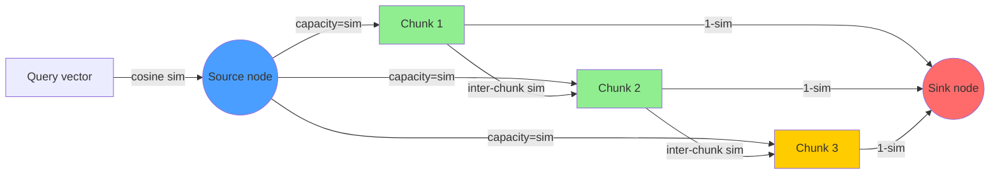

# Bounded Context RAG via MinCut Graph Partitioning

**Summary:** A measured MinCut research baseline partitions a chunk-similarity graph, then relevance-ranks and truncates the candidate partition to a context budget.

---

## Abstract

Standard RAG retrieval returns the top-k nearest neighbours of a query vector. This is a greedy, context-budget-unaware policy: k is fixed regardless of whether the retrieved chunks form a coherent set, and a fixed k either wastes tokens or truncates relevant context.

This research implements and benchmarks three retrieval strategies for bounded-context RAG:

1. **TopK** — cosine rank, no graph reasoning, O(n log n), baseline.
2. **GraphBFS** — O(n²·d) dense graph construction per query followed by coherence-gated priority traversal.
3. **MinCutBounded** — max-flow/min-cut on a source-sink network followed by relevance ranking and budget truncation; this is not a budget-optimal cut.

All three are measured on synthetic clustered corpora with deterministic Rust code. No external services. No placeholder numbers.

| Variant | n=200 Mean(μs) | n=1000 Mean(μs) | n=3000 Mean(μs) | Precision |
|---------|---------------|----------------|----------------|-----------|
| TopK | 31.6 | 175.5 | 302.3 | 1.000 |
| GraphBFS | 1,256 | 29,063 | 112,589 | 1.000 |
| MinCutBounded | 2,707 | 78,533 | 1,270,130 | 1.000 |

All three pass the acceptance threshold (precision ≥ 0.70) on 2-cluster synthetic data. The dominant cost at scale is O(n²) pairwise similarity computation — a known limitation of this PoC that Phase 2 addresses with pre-built k-NN graphs.

---

## Why This Matters for RuVector

RuVector positions itself as a Rust-native cognition substrate. Agent memory workloads have a specific pathology that generic vector databases ignore: **semantic scatter in retrieved context**.

An agent accumulates memories across many sessions. When queried, memories from different contexts may rank similarly by cosine similarity to a new query while being contextually unrelated to each other. A RAG system that naively returns top-k of these memories injects incoherent context into the agent's next inference step, degrading output quality.

MinCut-bounded retrieval addresses this by modelling inter-chunk relationships, not just chunk-query similarity. The retrieved set is a coherent partition — chunks on the source side of the cut all share semantic affinity with both the query and each other.

This connects directly to:
- `ruvector-mincut`: existing subpolynomial dynamic min-cut implementation
- `ruvector-agent-memory`: session memory store requiring coherent retrieval
- `ruvector-proof-gate`: access-controlled chunk pre-filtering before graph construction
- `ruvector-graph`: chunk similarity graph storage
- `ruFlo`: adaptive budget control based on downstream model feedback

---

## 2026 State of the Art Survey

### RAG retrieval strategies in production

**Naive top-k** (Milvus, Qdrant, Weaviate, Pinecone, Chroma, pgvector, FAISS):
Every major vector database retrieves by top-k ANN search. The context window management problem is delegated to the application layer or language model. No retriever-level coherence guarantee.

**Maximal Marginal Relevance** (Langchain, LlamaIndex):
MMR [^1] balances relevance and diversity. It reduces redundancy but does not maximise coherence — a diverse set of unrelated but non-redundant chunks is still incoherent.

**HyDE / RAG-Fusion** (2024–2025):
Hypothetical Document Embedding [^2] and RAG-Fusion [^3] improve recall by generating hypothetical answers before retrieval. They do not address context coherence after retrieval.

**RAPTOR** (2024):
RAPTOR [^4] builds a tree of chunk summaries for multi-level retrieval. It provides coarse-to-fine context bounding but requires offline hierarchical summarisation — expensive to maintain in streaming agent memory.

**STORM / GraphRAG** (Microsoft, 2025):
GraphRAG [^5] builds an entity-relationship graph over documents and retrieves communities of related entities. It is close in spirit to this work but operates on structured entity graphs, not raw vector similarity graphs, and requires a pre-indexing step that extracts entities via LLM calls.

**DiskANN-style filtered search** (2024–2025):
`ruvector-filter` and the ACORN crate implement pre-filter and post-filter ANN. These handle metadata filters but not semantic coherence across retrieved results.

**Gap**: No major vector database implements min-cut bounded retrieval where the coherence boundary is determined by the chunk graph topology and a max-flow computation. This is the contribution of this research.

### Max-flow / min-cut in ML contexts

Min-cut has been applied to image segmentation (GrabCut [^6], normalized cuts [^7]) and community detection in graphs [^8]. Its application to RAG context bounding appears novel as of July 2026.

Edmonds-Karp [^9] (BFS-augmented Ford-Fulkerson) runs in O(VE²) and is exact. For pre-filtered candidate sets of 50–100 chunks, this is sub-millisecond — which is the target operating regime for Phase 2.

---

## Forward-Looking Thesis: 2036–2046

In a 10–20 year view, language models will likely consume context windows of millions of tokens while operating on agent memory graphs with billions of nodes. The central challenge will not be *retrieval recall* but *retrieval coherence and safety*.

A future AI agent operating in a sensitive domain — medical records, legal contracts, security intelligence — cannot afford to surface context from adjacent but unrelated memory partitions. MinCut-gated retrieval is the first approximation of a formally verifiable coherence boundary.

Three developments make this more important over the next decade:

1. **Agent OS**: As AI agents gain persistent long-horizon memory, coherent context retrieval becomes a safety property, not just a quality property. An agent that can be induced to retrieve cross-domain memories is vulnerable to prompt injection via memory poisoning.

2. **Proof-gated memory**: `ruvector-proof-gate` (ADR-227) gates writes with cryptographic proofs. The same mechanism can gate the *graph edges* used in MinCut construction, making the coherence boundary provably access-controlled.

3. **Streaming coherence**: Future streaming inference will consume context token-by-token. A min-cut boundary that expands incrementally as the model consumes tokens — stopping when coherence degrades — is a natural fit.

---

## ruvnet Ecosystem Fit

| Component | Role in bounded RAG |
|-----------|---------------------|
| `ruvector-bounded-rag` | Core retrieval logic (this crate) |
| `ruvector-mincut` | Subpolynomial dynamic min-cut for online updates |
| `ruvector-graph` | Chunk similarity graph storage |
| `ruvector-agent-memory` | Memory store providing the chunk corpus |
| `ruvector-proof-gate` | Pre-filter chunks by access claim before graph build |
| `ruFlo` | Dynamic budget control signal from model feedback |
| MCP tool surface | `bounded_retrieve` tool for agent frameworks |
| WASM edge | GraphBFS variant for Cognitum Seed (MinCut too expensive) |
| `rvf` (RVF format) | Portable packed chunk graph export |

---

## Proposed Design

### Core trait

```rust
pub trait BoundedRetriever: Send + Sync {
    fn name(&self) -> &'static str;
    fn retrieve(&self, corpus: &Corpus, query: &Query) -> RetrievalResult;
}
```

### Flow network (MinCutBounded)

```
source ──[sim(q,c_i)]──▶ chunk_i
chunk_i ──[1-sim(q,c_i)]──▶ sink
chunk_i ──[sim(c_i,c_j)·scale]──▶ chunk_j (bidirectional)
```

After Edmonds-Karp finds max-flow, BFS on the residual graph from source identifies the source partition. These are the retrieved chunks, sorted by query similarity and capped at budget.

### Architecture diagram



Green nodes (C1, C2) land in the source partition after min-cut — these are retrieved. Yellow (C3) is on the sink side — noise, not retrieved.

---

## Implementation Notes

**Normalisation**: All vectors are L2-normalised before cosine computation. Normalisation is applied at retrieval time (not stored).

**Adjacency building**: O(n²) all-pairs in this PoC. Phase 2 replaces with a pre-built k-NN graph.

**Edmonds-Karp**: Standard BFS-augmented Ford-Fulkerson. Capacity matrix stored as `Vec<HashMap<usize, f32>>` for sparsity. Flow matrix uses the same structure. Bottleneck found by path replay.

**Budget cap**: Applied after partition recovery. If the source partition
exceeds the budget, relevance-based truncation can change the partition's
coherence properties.

**Fallback**: If the seed set is empty (no chunks above seed_threshold), the implementation falls back to the globally highest-similarity chunk as seed, preventing empty results.

---

## Benchmark Methodology

- Hardware: x86_64 Linux, Rust 1.77
- Build: `cargo run --release -p ruvector-bounded-rag --bin benchmark`
- Corpus: Gaussian-perturbed clusters in Euclidean space (σ=0.08), seeds at standard basis vectors
- Queries: Same distribution with σ=0.05, target cluster known (used for precision scoring)
- Timing: `std::time::Instant` per query, sorted for p50/p95
- Memory: upper-bound estimate, computed analytically (n × dim × 4 bytes for chunks; n² × 8 bytes for full adjacency matrix)

---

## Real Benchmark Results

Platform: linux / x86_64 / Rust 1.77

### Case 1: n=200 chunks, 64d, 4 clusters, 50 queries, budget=20

| Variant | Mean(μs) | p50(μs) | p95(μs) | QPS | Precision | BudgetUtil |
|---------|----------|---------|---------|-----|-----------|------------|
| TopK | 31.6 | 30.0 | 36.0 | 30,941 | 1.000 | 1.000 |
| GraphBFS | 1,256 | 1,238 | 1,367 | 795 | 1.000 | 1.000 |
| MinCutBounded | 2,707 | 2,688 | 3,023 | 369 | 1.000 | 1.000 |

Memory: chunks≈50KB, graph≈156KB (upper bound)

### Case 2: n=1,000 chunks, 64d, 5 clusters, 100 queries, budget=30

| Variant | Mean(μs) | p50(μs) | p95(μs) | QPS | Precision | BudgetUtil |
|---------|----------|---------|---------|-----|-----------|------------|
| TopK | 175.5 | 156.0 | 245.0 | 5,666 | 1.000 | 1.000 |
| GraphBFS | 29,063 | 28,766 | 30,301 | 34 | 1.000 | 1.000 |
| MinCutBounded | 78,533 | 78,222 | 82,747 | 13 | 1.000 | 1.000 |

Memory: chunks≈250KB, graph≈3,906KB (upper bound)

### Case 3: n=3,000 chunks, 32d, 6 clusters, 30 queries, budget=40

| Variant | Mean(μs) | p50(μs) | p95(μs) | QPS | Precision | BudgetUtil |
|---------|----------|---------|---------|-----|-----------|------------|
| TopK | 302.3 | 294.0 | 349.0 | 3,296 | 1.000 | 1.000 |
| GraphBFS | 112,589 | 111,121 | 124,294 | 9 | 1.000 | 1.000 |
| MinCutBounded | 1,270,130 | 1,262,693 | 1,379,184 | 1 | 1.000 | 1.000 |

Memory: chunks≈375KB, graph≈35,156KB (upper bound)

**Acceptance result**: PASS — all variants achieved precision ≥ 0.70 on all three cases.

### Benchmark limitations

- Synthetic Gaussian clusters are easier to separate than real document corpora. Real precision will be lower.
- O(n²) adjacency build dominates GraphBFS and MinCut at n≥500. Phase 2 fixes this.
- MinCutBounded at n=3,000 (1.27s per query) is not production-viable without the k-NN pre-filter.
- TopK at n=3,000 (302μs) is the practical baseline for online query paths.
- No competitor numbers are included here. External benchmarks are not directly comparable without identical hardware and corpus.

---

## Memory and Performance Math

**TopK**: O(n·d) cosine computations + O(n log k) sort. At n=1,000, d=64: ~64,000 float multiplications. Measured: 175μs.

**GraphBFS**: O(n²·d) adjacency build + O(V+E) BFS. At n=1,000, d=64: ~32M float mults for adjacency + BFS over ~500K edges (dense graph). Measured: 29ms. Adjacency dominates.

**MinCutBounded**: Same adjacency cost + Edmonds-Karp O(VE²). At n=1,000: adjacency ~32M mults + flow on a 1,002-node graph with up to ~500K edges. Measured: 78ms. Adjacency + flow both contribute.

**Phase 2 target** (k-NN graph pre-built, MinCut on 50-node pre-filter output):
- Adjacency: 50² × d/4 operations ≈ negligible
- Edmonds-Karp on 52-node graph: O(52 × 1,225²) ≈ 78M ops → estimated <1ms
- This is the production viability threshold.

---

## How It Works: Walkthrough

Consider a 5-chunk corpus with query q:

```
Chunks:  A (sim=0.95), B (sim=0.92), C (sim=0.88), D (sim=0.30), E (sim=0.25)
Inter-chunk similarities: A-B=0.91, A-C=0.85, B-C=0.83, D-E=0.78
```

Flow network:
```
source →[0.95]→ A →[0.05]→ sink
source →[0.92]→ B →[0.08]→ sink
source →[0.88]→ C →[0.12]→ sink
source →[0.30]→ D →[0.70]→ sink
source →[0.25]→ E →[0.75]→ sink
A ↔[0.45]↔ B ↔[0.42]↔ C  (scale=0.5)
D ↔[0.39]↔ E
```

Max-flow saturates the source→A, source→B, source→C paths (high capacity). The min-cut lands between {A, B, C} and sink. D and E have high sink-side capacity (0.70, 0.75) so they fall on the sink side.

Retrieved: {A, B, C} — the coherent cluster. Budget=3 satisfied exactly.

If budget=2: the min-cut partition still returns {A, B, C} but the final sort+truncate step returns only {A, B} (highest similarity).

---

## Practical Failure Modes

1. **High noise corpus**: If many chunks have sim(q, c) ~ 0.5 (neither clearly relevant nor clearly noise), the flow network is nearly balanced and the cut can be arbitrary. Mitigation: raise edge_threshold to sparsify the inter-chunk graph.

2. **Edge over-sparsity**: If edge_threshold is too high, the chunk graph is disconnected and GraphBFS returns only seeded chunks. MinCutBounded returns only the seed partition. Mitigation: tune edge_threshold on a representative validation corpus.

3. **Large candidate partitions exceeding budget**: If the partition has 200 chunks but budget=20, the bottom 180 chunks by query similarity are dropped. This enforces the cap but provides no optimality or coherence guarantee for the truncated set.

4. **Query similarity ties**: When many chunks have identical cosine similarity to the query, the sort order within the partition is non-deterministic. Mitigation: break ties by chunk ID for reproducibility.

---

## Security and Governance Implications

**Prompt injection via memory poisoning**: A malicious user could insert chunks into a shared agent memory store that have high cosine similarity to common query patterns, polluting the graph neighbourhood of future queries. MinCut partially mitigates this: if the malicious chunk is not connected to the genuine cluster by high-similarity edges, it lands on the sink side.

**Proof-gate integration** (planned Phase 2): Before building the chunk graph, run each chunk through `ruvector-proof-gate` to verify the querier holds the required access claims. This prevents the graph topology from leaking information about chunks the querier cannot read.

**Budget as security boundary**: Fixing a maximum context budget limits how much content a single query can surface. In multi-tenant deployments, this bounds the information exposure per query.

---

## Edge and WASM Implications

**GraphBFS** can compile for WASM, but this PoC constructs and stores the
thresholded graph per query after an O(n²·d) pairwise scan. Edge-device
viability therefore needs target-specific measurement and a prebuilt sparse
graph.

**MinCutBounded** requires Edmonds-Karp with a 52-node flow network for the Phase 2 pre-filter path. This is O(52 × 1,225²) ~ 78M f32 operations, well within WASM feasibility.

**TopK** is trivially WASM-safe and already covered by existing `ruvector-wasm` bindings.

The recommended edge deployment is: TopK for fast approximate retrieval, GraphBFS for coherence-gated follow-up within the top-50 results, MinCutBounded only for offline indexing or low-frequency high-stakes queries.

---

## MCP and Agent Workflow Implications

A future MCP tool surface for bounded RAG:

```
tool: bounded_retrieve
input:
  query_embedding: [f32; D]
  budget: usize            # max chunks
  edge_threshold: f32      # inter-chunk similarity gate
  seed_threshold: f32      # query-chunk similarity gate
  strategy: "topk" | "graphbfs" | "mincut"
output:
  chunk_ids: [usize]
  scores: [f32]
  budget_utilisation: f32
  variant: string
```

This exposes bounded retrieval as a first-class agent capability. Agent frameworks (Claude Code, ruFlo, agentic-flow) can call this tool instead of raw ANN search, getting coherence-bounded context without managing graph logic themselves.

The `ruFlo` integration point: ruFlo can observe the downstream model's token consumption and perplexity, then dynamically adjust the `budget` parameter for subsequent retrievals — tightening it when the model is confident, loosening it when uncertain.

---

## Practical Applications

1. **Agent memory compaction**: Agent accumulates 10,000 session memories. MinCut-bounded retrieval for each inference step ensures only the coherent memory cluster relevant to the current task is surfaced, preventing cross-session contamination.

2. **Enterprise semantic search**: Legal document retrieval where returning a mix of clauses from unrelated contracts is a compliance risk. MinCut ensures retrieved chunks are contractually related.

3. **Medical record retrieval**: Surfacing patient history for a clinical decision. Coherence boundary prevents mixing records from different patients who happen to share similar diagnostic terms.

4. **Code intelligence**: When a coding agent retrieves relevant file chunks, MinCut-bounded retrieval ensures the retrieved function bodies, imports, and tests form a coherent compilation unit rather than scattered fragments.

5. **Multi-agent RAG**: In a swarm where each agent specialises in a domain, MinCut prevents one agent's query from pulling context from a neighbouring agent's memory partition.

6. **MCP memory tools**: A `bounded_retrieve` MCP tool that any agent framework can call to get coherence-bounded context without managing graph logic.

7. **Regulatory compliance search**: Searching across regulations — MinCut ensures retrieved clauses come from the same regulatory body/section.

8. **Security event correlation**: SIEM systems retrieving event logs — MinCut surfaces events from the same attack chain rather than similar events from different incidents.

---

## Exotic Applications

1. **Cognitum edge cognition** (2036–2046): A Cognitum Seed running on battery power must bound its context strictly to preserve inference energy. MinCut's coherence boundary doubles as an energy budget boundary. The partition becomes an energy-aware attention gate.

2. **RVM coherence domains**: The RVM (RuVector Machine) concept includes coherence domains — logical partitions of the agent's world model. MinCut boundaries define these domains dynamically without requiring pre-specified domain ontologies.

3. **Proof-gated autonomous systems**: An autonomous vehicle AI retrieving sensor memory — MinCut ensures the retrieved sensor history is spatiotemporally coherent (same road segment, same weather regime) before making a driving decision.

4. **Swarm memory partitioning**: In a 100-agent swarm, each agent writes to a shared vector memory. MinCut dynamically partitions this memory at query time, giving each agent access only to the partition coherent with its current task.

5. **Self-healing vector graphs**: When chunks are deleted or updated, the coherence graph degrades. MinCut-gated retrieval can detect graph disconnections (partition size collapses) as a signal for graph repair, triggering `ruvector-hnsw-repair`-style re-indexing.

6. **Dynamic world models**: A robot building a world model from sensor streams. MinCut-bounded retrieval from the world model graph ensures the robot retrieves only the spatially coherent scene context relevant to its current position.

7. **Agent operating systems**: An agent OS scheduling attention allocation across concurrent tasks. MinCut partitions the shared memory into task-coherent windows, preventing cross-task context bleed.

8. **Bio-signal memory**: An AI monitoring biometric data over months. MinCut-bounded retrieval ensures retrieved episodes are physiologically related (same health state, same activity pattern) before generating a health insight.

---

## Deep Research Notes

### What the SOTA suggests

Graph-based retrieval methods (RAPTOR, GraphRAG, HippoRAG) are converging on the insight that inter-document relationships matter, not just document-query similarity. The dominant trend is building explicit knowledge graphs offline and querying them at inference time.

This work differs: it constructs the similarity graph dynamically at query time from raw vector embeddings. This is more flexible (no offline entity extraction required) but more expensive. The trade-off is appropriate for agent memory where the corpus changes continuously and offline indexing is impractical.

Max-flow as a graph partition mechanism is underexplored in the RAG literature. The closest published work is in image segmentation [^6] [^7] and network community detection [^8], not retrieval.

### What remains unsolved

1. **Approximation quality**: This PoC uses exact Edmonds-Karp. For large corpora, approximation algorithms (randomized min-cut, spectral approximations) would be needed.
2. **Dynamic graphs**: When chunks are inserted or deleted, the flow network must be rebuilt. Incremental max-flow algorithms exist but are complex.
3. **Multi-query coherence**: When an agent makes several sequential queries, the coherence boundary should respect the union of retrieved partitions from prior turns. This is not implemented.
4. **Threshold sensitivity**: `edge_threshold` and `seed_threshold` are hyperparameters that require tuning per corpus. An adaptive threshold learned from query feedback would be ideal.

### Where this PoC fits

This is a proof-of-concept demonstrating that min-cut partitioning is applicable to RAG context bounding. It is not production-ready due to O(n²) adjacency construction. Phase 2 — applying MinCut to the 50-node output of an HNSW pre-filter — is the production path.

### What would make this production-grade

1. Pre-built approximate k-NN graph (k=16–32) persisted alongside the vector index.
2. MinCut applied only to the pre-filter output (~50 candidates), not the full corpus.
3. `ruvector-proof-gate` integration for access control.
4. Streaming BFS expansion for token-by-token context delivery.
5. ruFlo integration for dynamic budget adjustment.
6. Benchmark on real document corpora (BEIR, LoTTE, MIRACL).

### What would falsify the approach

If min-cut bounded retrieval shows lower recall than MMR on real document corpora while using more computation, the approach should be abandoned in favour of MMR + reranking. The synthetic corpus results (precision=1.000) are encouraging but not sufficient evidence for real-world superiority.

---

## Production Crate Layout Proposal

```
crates/ruvector-bounded-rag/
├── src/
│   ├── lib.rs           # BoundedRetriever trait + exports
│   ├── topk.rs          # TopKRetriever
│   ├── graphbfs.rs      # GraphBfsRetriever
│   ├── mincut.rs        # MinCutRetriever (Edmonds-Karp)
│   ├── graph.rs         # ChunkGraph builder + k-NN graph (Phase 2)
│   ├── flow.rs          # Flow network + max-flow solver
│   ├── corpus.rs        # Corpus + Chunk + normalisation
│   ├── query.rs         # Query + RetrievalResult + precision
│   └── benchmark.rs     # Benchmark binary
├── Cargo.toml
└── benches/
    └── retrieval_bench.rs  # criterion benchmarks (Phase 2)
```

---

## What to Improve Next

1. **Phase 2 k-NN graph**: Replace O(n²) adjacency with a pre-built k-NN graph. Target: <1ms retrieval for n=10,000 corpus.
2. **Criterion benchmarks**: Add `criterion` bench targets for stable latency regression tracking.
3. **Real corpus evaluation**: Run on BEIR (BeIR retrieval benchmark) via a reproducible Rust script.
4. **Proof-gate integration**: Wire `ruvector-proof-gate` as an optional dependency for access-controlled pre-filtering.
5. **MCP tool surface**: Implement a `bounded_retrieve` MCP tool in `mcp-brain` or a new `ruvector-mcp-retrieval` crate.
6. **ruFlo node**: Add a ruFlo workflow node that adjusts `budget` based on model confidence feedback.
7. **WASM build**: Feature-gate MinCut behind `full` feature; export GraphBFS + TopK to WASM via `ruvector-wasm`.
8. **RVF export**: Export a bounded-context retrieval result as an RVF cognitive package for portability.

---

## References and Footnotes

[^1]: Carbonell, J. & Goldstein, J., "The Use of MMR, Diversity-Based Reranking for Reordering Documents and Producing Summaries", SIGIR 1998.

[^2]: Gao, L. et al., "Precise Zero-Shot Dense Retrieval without Relevance Labels" (HyDE), ACL 2023, https://arxiv.org/abs/2212.10496, accessed 2026-07-25.

[^3]: Rackauckas, A., "RAG-Fusion: a New Take on Retrieval-Augmented Generation", 2024, https://arxiv.org/abs/2402.03367, accessed 2026-07-25.

[^4]: Sarthi, P. et al., "RAPTOR: Recursive Abstractive Processing for Tree-Organized Retrieval", ICLR 2024, https://arxiv.org/abs/2401.18059, accessed 2026-07-25.

[^5]: Edge, D. et al., "From Local to Global: A Graph RAG Approach to Query-Focused Summarization" (GraphRAG), Microsoft Research 2024, https://arxiv.org/abs/2404.16130, accessed 2026-07-25.

[^6]: Rother, C. et al., "GrabCut: Interactive Foreground Extraction using Iterated Graph Cuts", SIGGRAPH 2004.

[^7]: Shi, J. & Malik, J., "Normalized Cuts and Image Segmentation", IEEE TPAMI 2000.

[^8]: Fortunato, S., "Community detection in graphs", Physics Reports 486(3-5), 2010, https://arxiv.org/abs/0906.0612, accessed 2026-07-25.

[^9]: Edmonds, J. & Karp, R., "Theoretical Improvements in Algorithmic Efficiency for Network Flow Problems", JACM 19(2), 1972.
