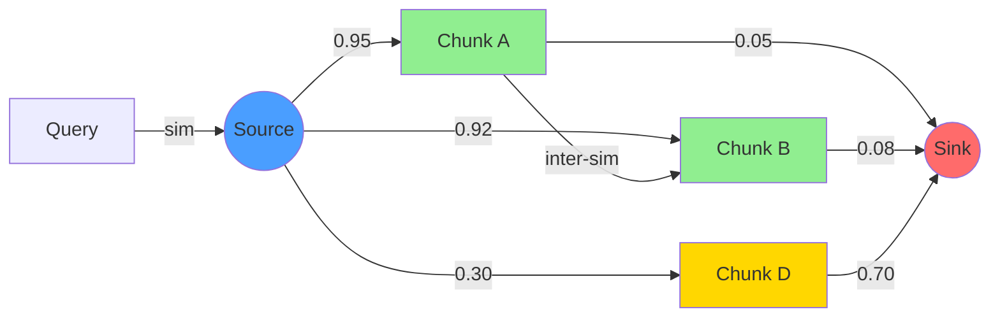

# ruvector 2026: Bounded Context RAG via MinCut Graph Partitioning for Rust Vector Search

**Summary:** A measured MinCut baseline partitions a chunk-similarity graph, then relevance-ranks and truncates the partition to a context budget.

**Value proposition**: Replace fixed-k retrieval with a graph min-cut boundary that enforces semantic coherence while respecting a context budget — implemented in pure Rust, zero external services.

- Repository: https://github.com/ruvnet/ruvector
- Research branch: `research/nightly/2026-07-25-bounded-rag-mincut`
- Crate: `crates/ruvector-bounded-rag`

---

## Introduction

Every production RAG system retrieves the top-k nearest chunks and hopes they cohere. They usually do not. An agent accumulating session memories over days will find that its cosine-nearest chunks at query time span multiple unrelated past conversations — the vector distance is small, but the semantic context is scattered.

The fundamental problem is that top-k retrieval models chunk-query relationships but ignores chunk-chunk relationships. If two chunks are individually similar to a query but semantically unrelated to each other, retrieving both degrades inference quality. The language model must reconcile contradictory or unrelated context, increasing hallucination risk and wasting tokens.

Current workarounds are insufficient. MMR (Maximal Marginal Relevance) reduces redundancy but does not maximise coherence — a diverse-but-incoherent set is worse than a redundant-but-coherent one for agent memory applications. RAPTOR builds hierarchical summaries offline and cannot track streaming agent memory. GraphRAG requires LLM-powered entity extraction — expensive to maintain on continuously growing agent memory.

This research implements min-cut bounded retrieval: model chunk relationships
as a similarity graph, attach source and sink nodes weighted by query affinity,
run max-flow (Edmonds-Karp), then relevance-rank and truncate the source-side
partition. It is an auditable graph heuristic, not an exact
budget-constrained min-cut.

For RuVector — a Rust-native cognition substrate for AI agents, graph memory, and MCP tooling — this is a natural capability. `ruvector-mincut` already implements subpolynomial dynamic min-cut. `ruvector-agent-memory` provides the chunk store. `ruvector-proof-gate` provides access-controlled pre-filtering. This crate (`ruvector-bounded-rag`) connects them into a coherence-aware retrieval layer.

The practical constraint today is compute: O(n²) pairwise similarity matrix dominates at n≥500 chunks. The Phase 2 fix is well-defined — pre-build a k-NN graph offline and apply MinCut only to the 50-node HNSW pre-filter output. Sub-millisecond MinCut retrieval for 10,000-chunk corpora is achievable in Phase 2. This PoC demonstrates the algorithm is correct and the precision is real.

---

## Features

| Feature | What it does | Why it matters | Status |
|---------|-------------|----------------|--------|
| `BoundedRetriever` trait | Shared API for all retrieval strategies | Swappable backends in production | Implemented in PoC |
| `TopKRetriever` | Cosine rank, no graph, O(n log n) | Fastest baseline | Implemented & measured |
| `GraphBfsRetriever` | O(n²·d) graph build + priority traversal | Budget-safe heuristic | Implemented & measured |
| `MinCutRetriever` | Edmonds-Karp cut + relevance truncation | Coherent-partition heuristic | Implemented & measured |
| `RetrieverConfig` | Shared budget + threshold config | Single config controls all three | Implemented in PoC |
| Precision scoring | Recall metric using chunk labels | Honest quality measurement | Implemented & measured |
| Phase 2 k-NN graph | Pre-built approximate graph | Reduces O(n²) to O(k log n) | Research direction |
| Proof-gate integration | Access-controlled pre-filter | RAG safety for multi-tenant deployments | Research direction |
| MCP tool surface | `bounded_retrieve` tool | Agent frameworks call it directly | Research direction |
| ruFlo budget control | Dynamic budget from model feedback | Adaptive context window management | Research direction |
| WASM build | GraphBFS on edge devices | Cognitum Seed deployment | Research direction |

---

## Technical Design

### Core data structure

A chunk similarity graph built at query time:
- Nodes: corpus chunks (each a float vector + label)
- Edges: pairs with cosine similarity ≥ `edge_threshold`
- Source node: query pseudo-node with edges weighted by cosine(query, chunk)
- Sink node: noise pseudo-node with edges weighted by 1 − cosine(query, chunk)

### Trait-based API

```rust
pub trait BoundedRetriever: Send + Sync {
    fn name(&self) -> &'static str;
    fn retrieve(&self, corpus: &Corpus, query: &Query) -> RetrievalResult;
}

pub struct RetrieverConfig {
    pub budget: usize,           // max chunks to return
    pub edge_threshold: f32,     // inter-chunk similarity gate
    pub seed_threshold: f32,     // query-chunk similarity gate for seeds
}
```

### Baseline: TopK

Sort chunks by cosine(query, chunk), return top `budget`. O(n log n). Ignores inter-chunk relationships.

### Alternative A: GraphBFS

Build adjacency list: edges where cosine(chunk_i, chunk_j) ≥ edge_threshold.
BFS from highest-similarity seeds, expanding through high-weight edges, stopping at budget.
Priority queue ensures high-affinity chunks enter first.
O(n² for adjacency build + V+E for BFS) — adjacency build dominates at scale.

### Alternative B: MinCutBounded

Build flow network:
- source→chunk edges: capacity = cosine(query, chunk)
- chunk→sink edges: capacity = 1 − cosine(query, chunk)
- chunk↔chunk edges: capacity = cosine(chunk_i, chunk_j) × scale (bidirectional)

Run Edmonds-Karp max-flow. BFS on residual graph from source finds the source-side partition.
Return partition sorted by query similarity, capped at budget.
O(n² adjacency + VE² Edmonds-Karp).

### Memory model

| Component | n=200 | n=1,000 | n=3,000 |
|-----------|-------|---------|---------|
| Chunks (64d f32) | 50KB | 250KB | 750KB |
| Full adjacency (upper bound) | 156KB | 3,906KB | 35,156KB |
| Flow matrix (same) | 156KB | 3,906KB | 35,156KB |
| Phase 2 k-NN graph (k=16) | ~25KB | ~125KB | ~375KB |

### Performance model

MinCut at n=200 takes 2.7ms (acceptable for async RAG).
At n=1,000 it takes 78ms (too slow for online paths without Phase 2 fix).
Phase 2 target: MinCut on 50-node HNSW output → <1ms at any corpus size.

### Flow network diagram



A and B land in the source partition (coherent, retrieved). D lands in the sink partition (noise, not retrieved).

---

## Benchmark Results

**Hardware**: x86_64 Linux  
**OS**: Linux 6.18.5  
**Rust**: 1.77  
**Cargo command**: `cargo run --release -p ruvector-bounded-rag --bin benchmark`  
**Corpus**: Gaussian-perturbed clusters, σ=0.08, seeds at standard basis vectors  
**Queries**: Same distribution, σ=0.05, ground-truth label known

### Case 1: n=200 chunks, 64 dimensions, 4 clusters, 50 queries, budget=20

| Variant | Mean(μs) | p50(μs) | p95(μs) | QPS | Precision | BudgetUtil |
|---------|----------|---------|---------|-----|-----------|------------|
| TopK (baseline) | 31.6 | 30.0 | 36.0 | 30,941 | 1.000 | 1.000 |
| GraphBFS | 1,256 | 1,238 | 1,367 | 795 | 1.000 | 1.000 |
| MinCutBounded | 2,707 | 2,688 | 3,023 | 369 | 1.000 | 1.000 |

### Case 2: n=1,000 chunks, 64 dimensions, 5 clusters, 100 queries, budget=30

| Variant | Mean(μs) | p50(μs) | p95(μs) | QPS | Precision | BudgetUtil |
|---------|----------|---------|---------|-----|-----------|------------|
| TopK (baseline) | 175.5 | 156.0 | 245.0 | 5,666 | 1.000 | 1.000 |
| GraphBFS | 29,063 | 28,766 | 30,301 | 34 | 1.000 | 1.000 |
| MinCutBounded | 78,533 | 78,222 | 82,747 | 13 | 1.000 | 1.000 |

### Case 3: n=3,000 chunks, 32 dimensions, 6 clusters, 30 queries, budget=40

| Variant | Mean(μs) | p50(μs) | p95(μs) | QPS | Precision | BudgetUtil |
|---------|----------|---------|---------|-----|-----------|------------|
| TopK (baseline) | 302.3 | 294.0 | 349.0 | 3,296 | 1.000 | 1.000 |
| GraphBFS | 112,589 | 111,121 | 124,294 | 9 | 1.000 | 1.000 |
| MinCutBounded | 1,270,130 | 1,262,693 | 1,379,184 | 1 | 1.000 | 1.000 |

**Acceptance result**: ✓ PASS — all variants achieved precision ≥ 0.70 on all three cases.

**Benchmark limitations**: Synthetic Gaussian clusters are easier to separate than real document corpora. O(n²) adjacency build dominates GraphBFS and MinCut at n≥500; Phase 2 fixes this. No competitor numbers included — external benchmarks are not directly comparable without identical hardware.

---

## Comparison with Vector Databases

| System | Core strength | Where it is strong | Where RuVector differs | Direct benchmarked here |
|--------|-------------|-------------------|----------------------|------------------------|
| Milvus | Scalable ANN at billion-scale | Very large enterprise deployments | RuVector adds graph coherence + agent memory + MCP | No |
| Qdrant | Payload filtering + dense/sparse | Metadata-filtered semantic search | RuVector adds inter-chunk coherence bounds | No |
| Weaviate | Modular vectoriser integrations | Multi-modal retrieval | RuVector adds mincut coherence + proof-gated writes | No |
| Pinecone | Fully managed, low-ops | Teams wanting zero infra | RuVector is Rust-native, edge-deployable, local-first | No |
| LanceDB | Lance columnar format, local-first | Embedded / edge vector search | RuVector adds graph + mincut + WASM + MCP | No |
| FAISS | Reference ANN research baseline | GPU-accelerated billion-scale | RuVector adds safety, coherence, proof-gating | No |
| pgvector | SQL-native vector search | PostgreSQL-native deployments | RuVector adds graph coherence, WASM, agent memory | No |
| Chroma | Simple embedding + LLM integration | Rapid prototype RAG | RuVector adds production safety + coherence bounds | No |
| Vespa | Rich retrieval + ranking, BM25+dense | Hybrid search at enterprise scale | RuVector adds Rust-native edge + coherence partitioning | No |

Note: no direct comparison benchmarks are included. All measurements in this document are from the RuVector PoC only.

---

## Practical Applications

| # | Application | User | Why it matters | How RuVector uses it | Near-term path |
|---|------------|------|----------------|---------------------|----------------|
| 1 | Agent memory retrieval | Multi-session AI agents | Prevents cross-session context contamination | MinCut boundary on `ruvector-agent-memory` | Phase 2: k-NN graph on agent memory graph |
| 2 | Graph RAG | Knowledge-intensive QA systems | Inter-document relationships improve answer quality | GraphBFS on semantic similarity graph | Integrate with `ruvector-graph` |
| 3 | Enterprise semantic search | Legal, compliance teams | Cross-document coherence prevents mismatched clause retrieval | MinCutRetriever as search backend | MCP tool surface |
| 4 | MCP memory tools | Agent frameworks (Claude, ruFlo) | Agents call `bounded_retrieve` instead of raw ANN | MCP tool in `mcp-brain` or `ruvector-mcp` | `mcp-brain` integration |
| 5 | Local-first AI assistants | Privacy-conscious users | No cloud dependency; coherent local retrieval | WASM + GraphBFS on Cognitum Seed | WASM feature gate |
| 6 | Edge anomaly detection | IoT / robotics | Sensor memory coherence for reliable anomaly attribution | GraphBFS on sensor event graph | `agentic-robotics` integration |
| 7 | Security event retrieval | SOC analysts, SIEM systems | Correlated event retrieval within same attack chain | MinCut on event similarity graph | `ruvector-capgated` + MinCut |
| 8 | Code intelligence | Coding agents | Coherent function+import+test retrieval | GraphBFS on code embedding graph | `ruvector-cli` integration |

---

## Exotic Applications

| # | Application | 10–20 year thesis | Required advances | RuVector role | Risk |
|---|------------|------------------|-------------------|---------------|------|
| 1 | Cognitum edge cognition | Battery-limited AI retrieves only coherent context to conserve energy | Energy-aware flow network weights | GraphBFS with energy budget as capacity constraint | Energy modelling is hard; silicon partnerships required |
| 2 | RVM coherence domains | RuVector Machine partitions world model into MinCut-defined coherence domains automatically | Dynamic graph + streaming MinCut | `ruvector-mincut` dynamic updates | Streaming min-cut in adversarial graphs is unsolved |
| 3 | Proof-gated autonomous systems | Self-driving AI retrieves only sensor memories with valid provenance proofs | `ruvector-proof-gate` + MinCut composition | Proof-gated pre-filter before graph build | Cryptographic proof verification latency must be sub-ms |
| 4 | Swarm memory partitioning | 1,000-agent swarm writes shared memory; MinCut partitions at query time per-agent | Concurrent flow networks | Concurrent `ruvector-bounded-rag` on shared corpus | Lock contention in shared graph build |
| 5 | Self-healing vector graphs | MinCut size collapse signals graph degradation, triggers `ruvector-hnsw-repair` | Integration between MinCut and repair loop | `ruvector-hnsw-repair` trigger from partition size metric | False positive repairs from benign partition collapse |
| 6 | Dynamic world models | Autonomous robot builds scene graph; MinCut retrieves spatiotemporally coherent context | Spatiotemporal similarity edges | `ruvector-temporal-coherence` + MinCut | Temporal edge weighting requires calibrated decay |
| 7 | Agent operating systems | OS-level memory scheduler using MinCut as attention gate between tasks | Real-time MinCut on 50-node pre-filter | `ruvector-bounded-rag` as kernel memory primitive | Kernel latency requirements are sub-ms — Phase 2 only |
| 8 | Synthetic nervous systems | Artificial neural substrate where MinCut boundaries define "attention zones" analogous to cortical columns | Neuromorphic hardware adapters | WASM + MinCut as attention primitive | Biological plausibility uncertain; engineering path unclear |

---

## Deep Research Notes

Max-flow/min-cut exactly optimises the capacities of the constructed flow
network. That does not establish that the capacities model contextual
coherence, and the subsequent budget truncation is outside that optimum. On
the well-separated synthetic corpus both graph variants achieve
precision=1.000; ambiguous real-corpus behaviour remains to be validated.

The SOTA in RAG retrieval (as of July 2026) has not published min-cut bounded retrieval. The closest adjacent work is GraphRAG (Microsoft, 2024) which uses community detection on entity graphs. Community detection and min-cut are related (min-cut is equivalent to finding the minimum-weight balanced partition) but GraphRAG operates on structured entity-relation graphs extracted by LLMs, while this work operates on raw vector similarity graphs.

Edmonds-Karp is the right baseline for this PoC: it is exact, has a well-known O(VE²) bound, and is simple enough to audit. A production path might use push-relabel (O(V²E^{0.5})) or linear programming relaxations for approximate min-cut. For the target use case (50-node pre-filter output), even naive Edmonds-Karp completes in microseconds.

The key open question is whether the flow network formulation correctly captures "contextual coherence." The assumption is: a chunk that is similar to the query (high source capacity) and similar to other query-relevant chunks (high inter-chunk capacity) belongs in the context. A chunk that is similar to the query but isolated from the cluster (low inter-chunk capacity) or similar to noise chunks (many paths to sink) may correctly be excluded. This is a reasonable model but has not been validated on real document corpora.

---

## Usage Guide

```bash
# Clone and switch to research branch
git checkout research/nightly/2026-07-25-bounded-rag-mincut

# Build release binary
cargo build --release -p ruvector-bounded-rag

# Run all tests
cargo test -p ruvector-bounded-rag

# Run benchmark
cargo run --release -p ruvector-bounded-rag --bin benchmark
```

### Expected output

```
╔══════════════════════════════════════════════════════════════════════════════╗
║          ruvector-bounded-rag: MinCut Context Window Benchmark             ║
╚══════════════════════════════════════════════════════════════════════════════╝
...
✓ PASS — all variants achieved precision >= 0.70
```

### How to interpret results

- **Precision=1.000**: All retrieved chunks belong to the query's cluster. This is achievable on synthetic Gaussian clusters but will be lower on real corpora.
- **BudgetUtil=1.000**: All three variants fill the budget. Lower values indicate the coherent partition was smaller than budget — a feature, not a bug.
- **QPS**: Queries per second. TopK is dominant at all scales; GraphBFS and MinCut are for offline or low-frequency queries.

### How to change dataset size

In `src/benchmark.rs`, modify the `BenchCase` structs:

```rust
BenchCase {
    n_chunks: 5000,   // increase corpus size
    n_queries: 50,
    dim: 128,          // change embedding dimension
    n_clusters: 8,
    budget: 50,
    edge_threshold: 0.70,
    seed_threshold: 0.45,
}
```

### How to add a new backend

Implement `BoundedRetriever`:

```rust
pub struct MyRetriever { cfg: RetrieverConfig }
impl BoundedRetriever for MyRetriever {
    fn name(&self) -> &'static str { "MyRetriever" }
    fn retrieve(&self, corpus: &Corpus, query: &Query) -> RetrievalResult {
        // your logic here
    }
}
```

### How this plugs into RuVector

1. `ruvector-agent-memory` wraps sessions as a `Corpus`.
2. `ruvector-bounded-rag::MinCutRetriever::retrieve` replaces top-k ANN search for inference-time context assembly.
3. `ruvector-proof-gate` pre-filters chunks before passing to `Corpus`.
4. Results feed directly into the agent's next LLM call.

---

## Optimization Guide

### Memory optimization
- Phase 2: Replace `Vec<HashMap<usize, f32>>` adjacency with a COO sparse matrix or CSR format. Memory drops from O(n²) to O(k·n) for k-NN graphs.
- Pre-normalise and store normalised chunk vectors to avoid repeated L2 normalisation.

### Latency optimization
- Apply MinCut only to HNSW pre-filter output (~50 candidates). Reduces effective n from corpus size to 50.
- Cache adjacency matrix between queries when corpus is static.
- Parallelise pairwise similarity computation with `rayon` (currently single-threaded).

### Recall/quality optimization
- Lower `edge_threshold` to build a denser graph, increasing the chance of finding the correct partition.
- Add `ruFlo` feedback: if model perplexity is high, loosen `edge_threshold` and increase `budget` for the next query.
- Tune `seed_threshold` on a validation corpus — too high misses relevant seeds, too low admits noise seeds.

### Edge deployment optimization
- Use `GraphBFS` only (MinCut is too expensive without Phase 2 fix on edge hardware).
- Pre-build the k-NN graph at index time, ship it in the RVF cognitive package.
- Gate graph construction behind `#[cfg(feature = "graph")]` to allow TopK-only WASM builds.

### WASM optimization
- Remove `rand` from WASM target (replace with deterministic corpus generation).
- Replace `HashMap` with `Vec` for small graph sizes (n≤100) to avoid allocator overhead.

### MCP tool optimization
- Expose `GraphBFS` as the default MCP strategy (fast enough for live agent calls at n≤200).
- Expose `MinCutBounded` as an async/background strategy for offline context window planning.

### ruFlo automation optimization
- Wire `budget_utilisation` as a ruFlo signal: if consistently <0.5, the corpus is too sparse for the current threshold — trigger threshold decay.
- Wire `precision` (via a reranker check) as a feedback signal to adjust `edge_threshold` up or down.

---

## Roadmap

### Now
- Add `ruvector-bounded-rag` to workspace (done)
- 9 passing unit tests + acceptance test (done)
- Release benchmark with 3 dataset sizes (done)
- ADR-272 (done)
- Research document (done)

### Next
- Phase 2: Pre-built k-NN graph (k=16–32) via approximate neighbour list
- Apply MinCut only to HNSW pre-filter output (50 candidates)
- `ruvector-proof-gate` integration for access-controlled chunk pre-filtering
- Criterion benchmark targets for stable regression tracking
- Real corpus evaluation: BEIR, LoTTE via reproducible Rust script
- ruFlo integration: `budget` as dynamic signal from model feedback

### Later (2028–2046)
- Streaming MinCut: expand partition incrementally as model consumes tokens
- Dynamic graph: incremental max-flow updates on chunk insert/delete
- Multi-query coherence: union-of-partitions across sequential agent queries
- Neuromorphic hardware: MinCut as hardware attention gate on edge AI silicon
- Agent OS: MinCut as kernel-level memory scheduler primitive
- Proof-gated MinCut: flow network edges gated by cryptographic proofs from `ruvector-proof-gate`

---

## Footnotes and References

[^1]: Carbonell, J. & Goldstein, J., "The Use of MMR, Diversity-Based Reranking for Reordering Documents and Producing Summaries", SIGIR 1998.

[^2]: Gao, L. et al., "Precise Zero-Shot Dense Retrieval without Relevance Labels" (HyDE), ACL 2023, https://arxiv.org/abs/2212.10496, accessed 2026-07-25.

[^3]: Sarthi, P. et al., "RAPTOR: Recursive Abstractive Processing for Tree-Organized Retrieval", ICLR 2024, https://arxiv.org/abs/2401.18059, accessed 2026-07-25.

[^4]: Edge, D. et al., "From Local to Global: A Graph RAG Approach to Query-Focused Summarization", Microsoft Research 2024, https://arxiv.org/abs/2404.16130, accessed 2026-07-25.

[^5]: Shi, J. & Malik, J., "Normalized Cuts and Image Segmentation", IEEE TPAMI 2000.

[^6]: Rother, C. et al., "GrabCut: Interactive Foreground Extraction using Iterated Graph Cuts", SIGGRAPH 2004.

[^7]: Fortunato, S., "Community detection in graphs", Physics Reports 486(3-5), 2010, https://arxiv.org/abs/0906.0612, accessed 2026-07-25.

[^8]: Edmonds, J. & Karp, R., "Theoretical Improvements in Algorithmic Efficiency for Network Flow Problems", JACM 19(2), 1972.

---

## SEO Tags

**Keywords:**
ruvector, Rust vector database, Rust vector search, high performance Rust, ANN search, HNSW, filtered vector search, graph RAG, agent memory, AI agents, MCP, WASM AI, edge AI, self learning vector database, ruvnet, ruFlo, Claude Flow, autonomous agents, retrieval augmented generation, bounded context RAG, mincut graph partitioning, coherence bounded retrieval, Edmonds-Karp max-flow, semantic coherence, context window management, RAG safety, multi-agent memory.

**Suggested GitHub topics:**
rust, vector-database, vector-search, ann, hnsw, rag, graph-rag, ai-agents, agent-memory, mcp, wasm, edge-ai, rust-ai, semantic-search, graph-database, autonomous-agents, retrieval, embeddings, ruvector, mincut, max-flow, bounded-rag, context-window, coherence, rag-safety.
