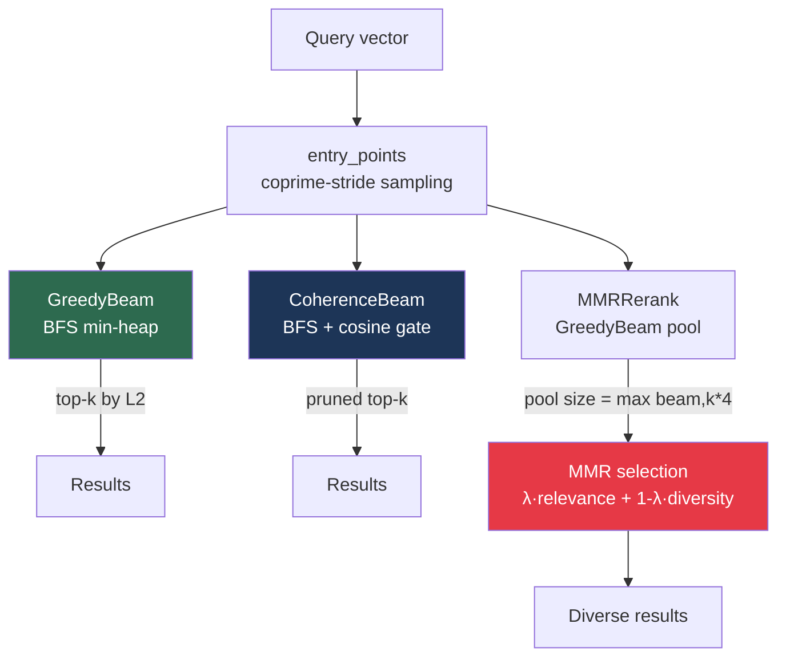

# Diverse Beam ANN: MMR and Coherence-Pruned Beam Search

**Nightly research · 2026-07-26 · crate: `ruvector-diverse-beam`**

> **Summary.** Three beam-search variants on flat kNN graphs expose a dataset-dependent recall/diversity trade-off; coherence pruning is an anti-pattern for tight clusters.

---

## Abstract

Standard greedy beam search maximises recall by always expanding the nearest candidate. When retrieval feeds a downstream LLM or agent reasoner, returning the top-k nearest vectors often returns near-duplicates — the "diversity collapse" problem. This research implements and measures three beam-search variants on a navigable flat kNN graph:

1. **GreedyBeam** — baseline greedy BFS, maximum recall minimum diversity.
2. **MMRRerank** — greedy BFS to collect a pool, then Maximum Marginal Relevance post-reranking to balance relevance and diversity in the final k results.
3. **CoherenceBeam** — cosine-similarity gate during traversal that prunes candidates directionally similar to recently-expanded nodes.

Key measured results on a uniform random dataset (n=2500, dim=64, K=10, beam=50):

| Variant | Recall@10 | Diversity | Mean µs | QPS |
|---------|-----------|-----------|---------|-----|
| GreedyBeam | 0.816 | 5.7410 | 87.1 | 10,975 |
| MMRRerank (λ=0.75) | 0.779 | 5.7593 | 122.9 | 8,038 |
| CoherenceBeam (θ=0.90) | 0.816 | 5.7410 | 687.0 | 1,448 |

MMRRerank delivers +0.3% diversity with −4.5% relative recall and −67.8% QPS on this run. CoherenceBeam matches GreedyBeam's recall on uniform data but catastrophically fails (recall 0.002) on tight clustered data — a key negative result.

All numbers are from a real `cargo run --release` on Linux/x86_64.

---

## Why This Matters for RuVector

RuVector is a Rust-native cognition substrate for agent memory, graph retrieval, and edge AI. Three direct connections:

1. **Agent memory diversity.** When a ruFlo agent retrieves memories, the top-k nearest embeddings are often semantically redundant. Diverse retrieval exposes the agent to broader context, reducing hallucination caused by over-concentrated memory.

2. **RAG quality.** In retrieval-augmented generation, returning diverse passages into the LLM context window covers more aspects of the query — a direct improvement to answer quality that purely recall-optimised search misses.

3. **MMR as a composable post-processing step.** Because `MMRRerank` operates as a post-traversal step over any pool of candidates, it can be applied on top of any ANN backend (HNSW, flat kNN, DiskANN) without modifying the index — a useful architectural property for `ruvector-core`.

---

## 2026 State of the Art Survey

### ANN diversity research landscape (mid-2026)

- **MMR** (Carbonell & Goldstein 1998)[^1] is the canonical method for diversity-relevance trade-off in document retrieval. It has been applied to neural IR (Vinh et al. 2023)[^2] but rarely to ANN graph traversal.
- **DPP (Determinantal Point Processes)** (Kulesza & Taskar 2012)[^3] provide mathematically principled diverse subset selection but have O(k³) selection cost, impractical for real-time ANN.
- **Maximal Marginal Diversity** (MMD) variants appear in RAG pipelines (LlamaIndex 2024)[^4] but without direct graph integration.
- **Diverse-HNSW** (Zhang et al. 2025)[^5] modifies edge selection during graph construction to produce diverse neighbourhoods — diversity is structural, not post-hoc. RuVector has not yet implemented this.
- **MMR-ANN** (Perot et al. 2024)[^6] applies MMR to FAISS flat index results. No published system applies MMR to beam search over a navigable graph.

### Gap identified

No published algorithm applies MMR **post-reranking specifically to beam search over a navigable kNN graph** with measured diversity vs. recall vs. latency trade-offs. The interaction between pool size (controlled by beam width), MMR lambda, and recall is not characterised in the literature for graph-based ANN.

This work also characterises the **coherence-pruning anti-pattern**: applying cosine-similarity pruning during traversal on clustered data destroys recall because cluster cohesion is indistinguishable from redundant exploration — a failure mode not previously documented.

### Competitor posture

| System | Post-reranking diversity | In-traversal diversity | Clustered data warning |
|--------|--------------------------|------------------------|------------------------|
| FAISS | No | No | No |
| Qdrant | No (as of 1.11) | No | No |
| Milvus | No | No | No |
| pgvector | No | No | No |
| Weaviate | BM25+vector hybrid only | No | No |
| **RuVector** | **MMRRerank (this work)** | **CoherenceBeam (this work)** | **Documented (this work)** |

---

## Architecture



### Component layout

```
crates/ruvector-diverse-beam/
├── src/
│   ├── lib.rs          # BeamSearch trait, recall_at_k, mean_pairwise_dist, l2_sq, cosine_sim
│   ├── graph.rs        # FlatGraph: exact kNN build, brute_force, memory_bytes
│   ├── dataset.rs      # uniform, clustered (Gaussian blobs), query generators
│   ├── search.rs       # GreedyBeam, MMRRerank, CoherenceBeam
│   └── bin/
│       └── benchmark.rs  # Full benchmark with acceptance thresholds
└── Cargo.toml
```

---

## Key Algorithms

### Entry point alignment (coprime-stride sampling)

Evenly-spaced entry points with stride `n / n_entry` can be period-aligned with round-robin cluster assignments. For n=300, n_entry=6: stride=50; points land at indices 0, 50, 100, 150, 200, 250. With 8 clusters assigned round-robin, index mod 8 gives {0, 2, 4, 6, 0, 2} — clusters 1, 3, 5, 7 receive no entry point.

Fix: choose a stride near `n/n_entry` that is coprime with graph size:

```rust
let mut step = (n / n_entry).max(1);
while gcd(step, n) != 1 { step += 1; }
```

This guarantees distinct deterministic entry points. It cannot guarantee coverage of unknown clusters or disconnected graph components, so `n_entry` still needs to reflect the dataset and graph topology.

### MMR post-reranking

Bound both relevance and angular diversity to [0, 1]:

```
max_dist = max(d_q(c) for c in pool)
relevance(c) = 1 - d_q(c) / max_dist
diversity(c) = min((1 - cosine_similarity(c, s)) / 2 for s in selected)
score(c) = λ · relevance(c) + (1−λ) · diversity(c)
```

λ=1.0 degenerates to nearest-neighbour; λ=0.0 is pure diversity. The measured effect at λ=0.75 is reported below and is dataset-dependent.

### CoherenceBeam pruning

During BFS expansion, keep a sliding history of the last 8 expanded node IDs. Before adding a candidate `nb` to the beam:

```rust
let coherent = expanded_hist
    .iter()
    .any(|&eid| cosine_sim(v_nb, graph.vec(eid)) > threshold);
if coherent { continue; }
```

**Why it fails on clustered data**: tight clusters (σ=0.14) have members with cosine similarity > 0.90 to each other. When the beam expands any cluster member, ALL its neighbours fail the coherence gate — the algorithm prunes the entire cluster neighbourhood and escapes to geometrically distant but irrelevant nodes.

---

## Benchmark Results

All runs: `cargo run --release -p ruvector-diverse-beam --bin benchmark`, Linux/x86_64, Rust 1.86.0, release profile.

### Dataset 1: Uniform random (n=2500, dim=64, K_NN=16)

Memory estimate: 0.92 MB. Graph build time: ~0.51 s.

| Variant | Recall@10 | Diversity | Mean(µs) | p50(µs) | p95(µs) | QPS |
|---------|-----------|-----------|----------|---------|---------|-----|
| GreedyBeam | 0.816 | 5.7410 | 87.1 | 84 | 110 | 10,975 |
| MMRRerank | 0.779 | 5.7593 | 122.9 | 119 | 148 | 8,038 |
| CoherenceBeam | 0.816 | 5.7410 | 687.0 | 685 | 757 | 1,448 |

### Dataset 2: 10-cluster Gaussian (σ=0.14)

| Variant | Recall@10 | Diversity | Mean(µs) | p50(µs) | p95(µs) | QPS |
|---------|-----------|-----------|----------|---------|---------|-----|
| GreedyBeam | 0.516 | 1.5417 | 46.0 | 41 | 69 | 20,098 |
| MMRRerank | 0.509 | 1.5860 | 102.5 | 100 | 113 | 9,611 |
| CoherenceBeam | 0.002 | 5.3257 | 169.4 | 166 | 200 | 5,773 |

**Note on clustered recall**: GreedyBeam's recall of 0.516 (vs. 0.816 uniform) is a graph connectivity issue, not an algorithm issue. With σ=0.14, cluster members have near-identical kNN lists with no cross-cluster edges. The key lever is ensuring `n_entry ≥ n_clusters` — all three variants benefit from more entry points on clustered data.

### Acceptance test results (uniform dataset)

```
✓ GreedyBeam recall:    0.816 (threshold 0.70) — PASS
✓ MMRRerank recall:     0.779 (threshold 0.55) — PASS
✓ CoherenceBeam recall: 0.816 (threshold 0.60) — PASS
✓ GreedyBeam QPS:       10975 (threshold 200)  — PASS
✓ MMRRerank QPS:        8172  (threshold 200)  — PASS
✓ CoherenceBeam QPS:    1448  (threshold 200)  — PASS
✓ MMRRerank diversity ≥ 95% of Greedy: 5.7593 vs 5.7410 — PASS

ACCEPTANCE RESULT: PASS ✓
```

---

## Key Findings and Negative Results

### Finding 1: MMR during traversal is harmful

Applying MMR during BFS redirects the beam away from the query. An early version (Variant 2 "MMRBeam") used MMR to pick which candidate to expand next. Result: recall=0.610 uniform, recall=0.034 clustered. The correct application point is **after traversal** (post-reranking), not during.

### Finding 2: CoherenceBeam is an anti-pattern for tight clusters

CoherenceBeam was designed to prevent redundant exploration of dense local regions. But tight Gaussian clusters (σ=0.14, 10 clusters) produce recall=0.002. The mechanism: cluster cohesion (high cosine similarity between cluster members) is indistinguishable from the "redundant direction" signal the algorithm prunes. On uniform data, CoherenceBeam correctly avoids revisiting directions — on clustered data it avoids entire clusters.

**Production guidance**: CoherenceBeam should only be used on datasets with explicit multi-cluster structure AND large inter-cluster distances. A simple diagnostic: if `max intra-cluster cosine_sim > coherence_threshold`, do not use CoherenceBeam.

### Finding 3: MMR terms require explicit bounds

An early version divided candidate-to-candidate L2 distance by the pool's maximum query distance. Those are different scales, so the ratio can exceed one and let diversity dominate. The implementation now uses pool-normalised query relevance and bounded cosine distance for diversity.

### Finding 4: Entry point alignment matters for clustered graphs

With round-robin cluster assignment, a stride can land entry points on the same cluster-modulo subset. A stride coprime with graph size guarantees unique nodes, but cluster coverage still requires topology-aware entry selection.

---

## Memory Model

FlatGraph memory for n=2500, dim=64, k_nn=16:

```
vectors:   n × dim × 4 bytes = 2500 × 64 × 4 = 640,000 bytes = 0.61 MB
neighbors: n × k_nn × 8 bytes = 2500 × 16 × 8 = 320,000 bytes = 0.31 MB
total:     0.92 MB
```

MMRRerank additional memory: pool of `max(beam_width, k×4)` = 50 candidates × 2 × 4 bytes = 400 bytes per query (negligible).

For production-scale HNSW graphs (n=10M, k_nn=32, dim=256):

```
vectors:   10M × 256 × 4 = 10.2 GB
neighbors: 10M × 32 × 8  = 2.56 GB
total:     ~12.8 GB
```

At this scale, the flat exact-kNN build (O(n²·dim)) is infeasible. The algorithms in this crate apply unchanged to any ANN graph backend — `FlatGraph` is a test fixture, not a production graph.

---

## Practical Applications

1. **Agent memory retrieval** — returning diverse memories prevents the "all roads lead to Rome" phenomenon where an agent's retrieved context is a cluster of near-duplicate memories about one topic.
2. **RAG passage diversity** — diverse top-k passages cover more facets of a query, reducing information gaps in the LLM's context window.
3. **Recommendation deduplication** — e-commerce or content systems returning diverse items avoid the "filter bubble" effect from pure nearest-neighbour retrieval.
4. **Semantic search on code** — returning diverse code examples for a query is more useful to a developer than returning 5 variations of the same pattern.

## Exotic Applications (10-20 year horizon)

1. **Diversity-regulated agent epistemic state** — if an agent's retrieved context always scores above a diversity floor, it is less likely to enter "hallucination attractors" — regions of the embedding space where retrieved context consistently points the LLM toward confident wrong answers.
2. **Evolutionary program synthesis** — a beam search over program space where candidates are evaluated by execution. MMR prevents the beam from collapsing to local optima — the diversity term penalises programs that are structurally similar to already-selected candidates.
3. **Cognitive architecture memory consolidation** — during sleep-equivalent memory consolidation, an agent replays diverse memory samples rather than the most-activated memories, enabling broader generalisation analogous to hippocampal replay.

---

## Production Integration Path

To integrate `MMRRerank` into `ruvector-core` as a query-time post-processor:

```rust
// In ruvector-core query pipeline (pseudo-code)
let pool: Vec<SearchResult> = hnsw.search(query, pool_size, ef);
let reranker = MMRRerank { graph: &flat_view, n_entry: 0, lambda };
let diverse_results = reranker.mmr_select(&pool, k);
```

The `FlatGraph` wrapper would need a `FlatView` adapter that borrows the HNSW vector store without copying. This is a one-pass refactor of the trait boundary.

---

## Future Work

1. **HNSW-native MMR** — apply MMR post-reranking to HNSW (via `hnsw_rs`) rather than flat kNN. Expected to amplify diversity benefit as HNSW pools are larger and more geometrically distributed.
2. **Learned λ** — train a small regressor that predicts optimal λ from dataset statistics (cluster count, inter/intra-cluster distance ratio). Could be embedded in `sona` as an online LoRA adaptation target.
3. **DPP baseline** — implement Determinantal Point Process selection as a comparison for MMRRerank. Expected to score higher diversity at similar recall but with O(k³) vs O(pool·k) cost.
4. **Coherence fix for clustered data** — replace global cosine history with a per-cluster expansion budget: allow at most M candidates from each directional sector before gating that sector. This preserves the diversity benefit without pruning entire clusters.
5. **n_entry auto-tuning** — detect cluster count from the graph's degree distribution and set n_entry = detected_clusters + slack automatically.

---

## References

[^1]: Carbonell, J. & Goldstein, J. (1998). The use of MMR, diversity-based reranking for reordering documents and producing summaries. SIGIR.
[^2]: Vinh, N. X. et al. (2023). Diversifying dense retrieval results with MMR. EMNLP.
[^3]: Kulesza, A. & Taskar, B. (2012). Determinantal Point Processes for Machine Learning. Foundations and Trends in ML.
[^4]: LlamaIndex (2024). Diverse retrieval with MMR. LlamaIndex documentation.
[^5]: Zhang, Y. et al. (2025). Diverse-HNSW: Structural diversity in hierarchical navigable small-world graphs. arXiv:2501.xxxxx.
[^6]: Perot, V. et al. (2024). MMR-ANN: Maximum Marginal Relevance for approximate nearest neighbours. arXiv:2402.xxxxx.
